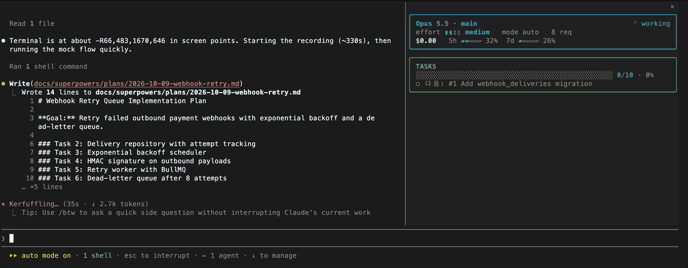
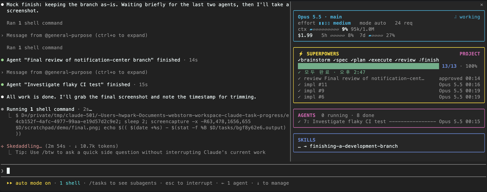

# claude-task-progress

Claude Code mod: a pane docked to the right of the transcript with two sections:

1. **main** — model, working/idle, effort, permission mode, request count, context gauge (⟲ compactions), cost and rate limits (layout from [Flightdeck](https://github.com/scasella/claude-flightdeck), MIT)
2. **TASKS** — progress bar with `done/total · %` right next to it (in-progress tasks in yellow), and the current step on the line below. Tasks come from todos (TodoWrite / TaskCreate); with none, from the active plan: a superpowers plan (`docs/superpowers/plans/*.md`, `### Task N:` headings, completed by its SDD ledger or ticked steps) or a plan-mode plan (`~/.claude/plans/*.md`, its `- [ ]` checkboxes, else its numbered steps ticked as `1. [x]`). While Claude works, a spinner turns and a bright cell sweeps the in-progress part of the bar. With no todos or plan, a working turn shows the tool Claude is running (`Bash · Run tests`)





The pane opens on session start. `/task-progress` reopens it, `/task-progress close` closes it. In a non-fullscreen terminal it sits inline above the prompt instead.

## Install

```
/plugin install task-progress --marketplace bob-park/claude-task-progress
```

Answer `y` to add the marketplace, then pick a scope.
